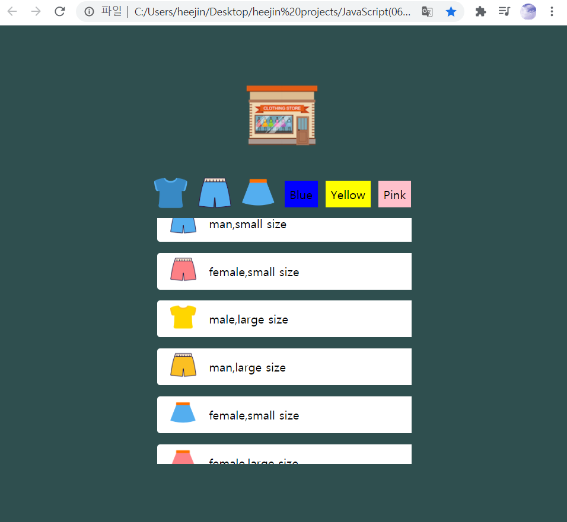

# JavaScript_study
- 콘솔출력, script asunc와 defer의 차이점
- 데이터 타입
- operator, if, for 반복문
- arrow Function
- class, object
- object??
- 배열

# 미니 프로젝트 - 미니몰 만들기  
# 첫 화면  
  

# 옷의 종류별로 리스트 구현   
# 옷의 색상별로 리스트 구현   
